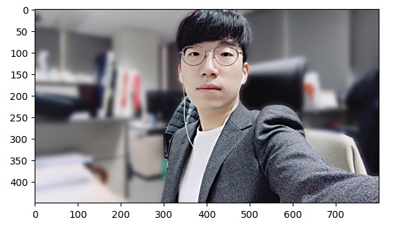
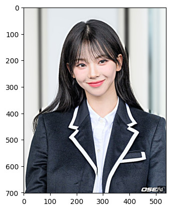
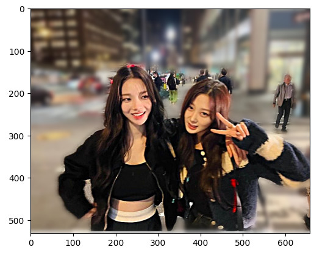
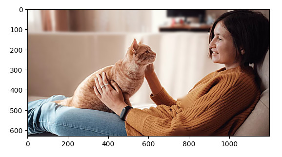
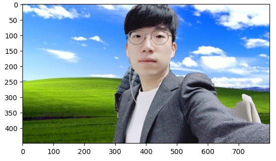
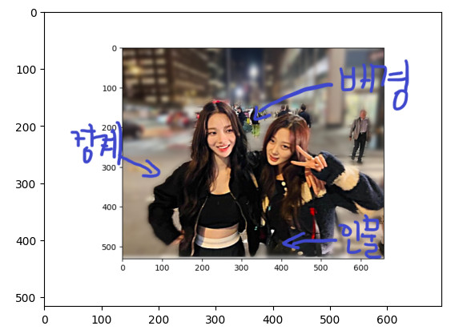
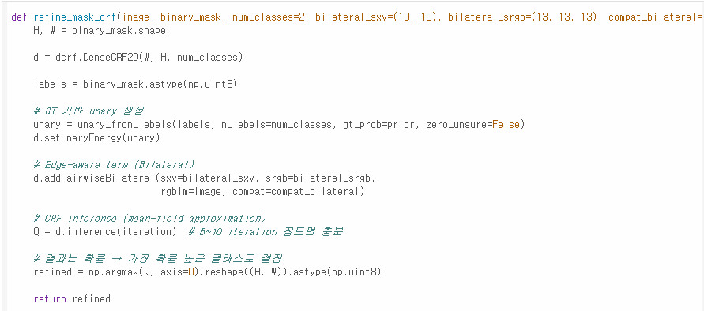
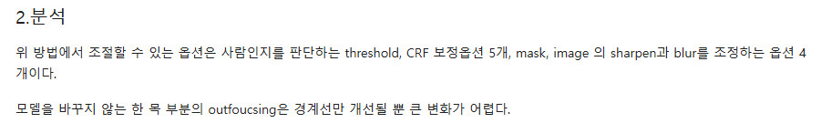
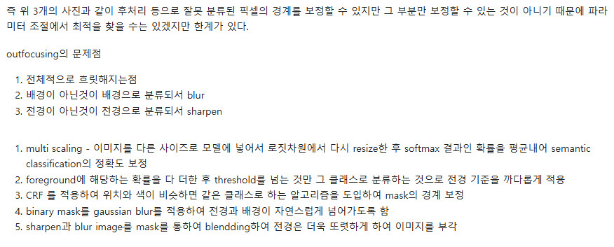

# AIFFEL Campus Online Code Peer Review Templete
- 코더 : 최현영
- 리뷰어 : 김성훈


# PRT(Peer Review Template)
- [x]  **1. 주어진 문제를 해결하는 완성된 코드가 제출되었나요?**
    - 아웃포커싱 적용 인물 사진
    - 
    - 
    - 

    - 아웃포커싱 적용 동물과 인물 사진
    - 
     
    - 배경전환 크로마키 사진
    - 
     
    - outfocusing의 문제점 지적
        - 전체적으로 흐릿해지는점
        - 배경이 아닌것이 배경으로 분류되서 blur
        - 전경이 아닌것이 전경으로 분류되서 sharpen

    - 문제점 표기
    - 
    
    
- [x]  **2. 전체 코드에서 가장 핵심적이거나 가장 복잡하고 이해하기 어려운 부분에 작성된 
주석 또는 doc string을 보고 해당 코드가 잘 이해되었나요?**
    - LMS 노드를 통해 배운 것과는 다른 완전히 새로운 방식을 공부해서 적용한 부분
        - CRF 등 어려운 부분에 주석을 달아 이해를 도왔고 이를 통해 별도로 찾아보고 공부할 수 있을 것 같아서 좋았음.
    - 
     
    - 새로운 방식, 새로운 모델을 적용하며 발생한 문제와 Segmentation의 아쉬운 부분을 채우기 위한 Sharpening 시도
    - 

    - 해당 코드 블럭이 해당 방식을 활용하는 방법이기도, 최선의 결과를 내도록 노력한 부분이기도 하기 때문에 핵심적이라고 생각함.

        
- [x]  **3. 에러가 난 부분을 디버깅하여 문제를 해결한 기록을 남겼거나
새로운 시도 또는 추가 실험을 수행해봤나요?**
    - 전체 과정 자체가 거의 새로운 시도들로 가득했음.
    - 문제 원인 및 해결 과정을 상세히 기록하였음.
    - 
    - 

        
- [x]  **4. 회고를 잘 작성했나요?**
    - 문제를 해결하는 과정에서의 고민을 중간 중간 기록하였고 이를 반영하여 새로운 시도를 적용한 부분까지 전체에 녹아있음.
        - 관련 사진은 "3번" 문항에 첨부된 사진 참고 .
    
        
- [x]  **5. 코드가 간결하고 효율적인가요?**
    - 반복되는 작업에 대한 코드 함수화로 중복 없이 모듈화 진행
          - 관련 사진은 "2번" 문항에 첨부된 사진 참고.


# 회고(참고 링크 및 코드 개선)
```
- LMS에서 배운 코드를 기반으로 좀 더 쉽게 갈 수 있었으나, 새로운 모델과 방식을 적용해보며 깊게 공부한 모습이 인상 깊었다.
- 문제점을 분석하고 해결 방안을 제시하는 것에서 그치지 않고 직접 여러가지 시도와 결과물을 낸 부분이 좋았다.
- 해당 코드와 방식으로 보며 새로운 방법에 대해 배워갈 수 있고 추가적인 공부가 된 것 같아서 좋았다.
```
