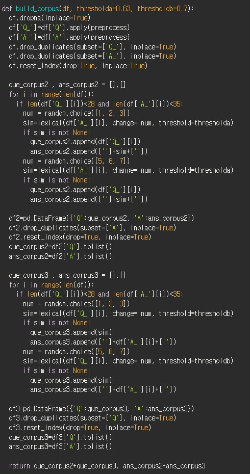

# AIFFEL Campus Online Code Peer Review Templete
- 코더 : 최현영
- 리뷰어 : 김범모

# PRT(Peer Review Template)
- [X]  **1. 주어진 문제를 해결하는 완성된 코드가 제출되었나요?**

        - Transformer를 사용하여 챗봇 학습을 성공적으로 진행하였습니다.

        - 주어진 예문에 대해 파라미터튜닝한 모델별로 BLUE 스코어를 확인하였습니다.

    
- [X]  **2. 전체 코드에서 가장 핵심적이거나 가장 복잡하고 이해하기 어려운 부분에 작성된 
주석 또는 doc string을 보고 해당 코드가 잘 이해되었나요?**

        - 네 함수화 되어있어 어떤 기능인지 알 수 있었고 코드 이해에 어려움이 없었습니다.

- [X]  **3. 에러가 난 부분을 디버깅하여 문제를 해결한 기록을 남겼거나
새로운 시도 또는 추가 실험을 수행해봤나요?**

        - 하이퍼파라미터 튜닝을 해도 validation loss가 낮아지지 않으니 lexical 데이터 증강 방법을 수정해서 성능을 올렸습니다.
        - 데이터 증강을 한 데이터로 학습하여 validation loss를 크게 낮출 수 있었습니다.
       
        
- [X]  **4. 회고를 잘 작성했나요?**

        - 회고를 자세하게 정리를 잘 해주셨습니다.
       

        
- [X]  **5. 코드가 간결하고 효율적인가요?**

        - 대부분의 코드가 간결하고 효율적이었습니다.
        - 그리고 함수화 되어있어서 어떤 기능을 구현하시고 조합하셨는지 이해하기 쉬웠습니다.

# 회고(참고 링크 및 코드 개선)
하이퍼파라미터 튜닝 부분과 회고 정리하신걸 보면 프로젝트를 하시면서 많은 분석과 고민을 하신게 느껴졌습니다.
